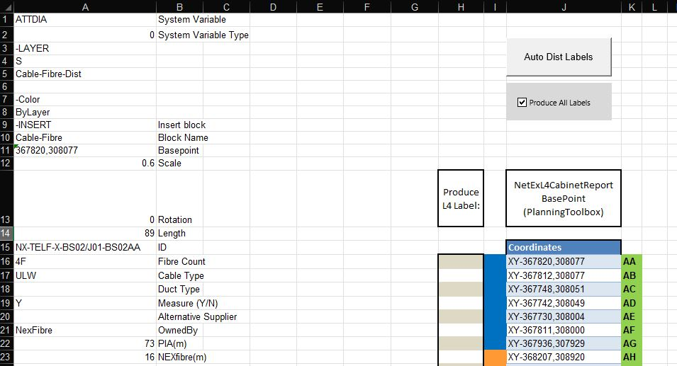
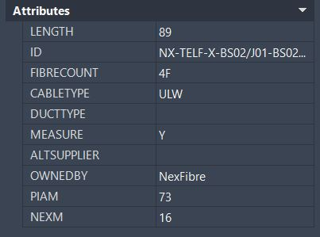

# Overview
Visual Basics projects are two of my recent projects undertaken at BDS Global to remove repetative tasks, increase accuracy & reduce time for completion. 

## 1. Automatic Distribution Labels - Creating an Excel-AutoCAD Interoperable Data Pathway
This project is one that I am most proud of due to the huge reduction in taskcompletion time & accuracy. Taking user input data from a complex Spreadsheet type database, where the data is transformed and manipulated for a vast array of use cases. 

### One such usecase is the AutoDistLabels script



#### View the code here: [AutoDistLabels](https://github.com/HJR41/VisualBasic/blob/main/AutoDistLabels.vba)

The script takes multiple intricate data points, and places them into an AutoCAD compatible text string within Excel for the user to simply copy the string into the AutoCAD textbar. Consequently, CAD instantly generates between 30-100 highly data dense poly-line labels.


The script reduced the average task completion time from approximately 4-8+ hours to approximately 1-2 hours saving countless hours of valuable resource & delivering pin-point accuracy.




#### Visualise VB Loop:
```vb
   For v = 16 To 135
    If (blAllLabelsLink And wsDistLabels.Cells(v, lngJntMescol).Value > 0) Or (Not blAllLabelsLink And wsDistLabels.Cells(v, lngSelectedJntLbl).Value > 0) Then
            If wsDistLabels.Cells(v, lngJntMescol).Value = "N" Then
                rngcircletargetresize.Value = rngCircle.Value 'If Measure is set to no then put a circle at the bottom           
                strBaseP = "'" & Mid(wsDistLabels.Cells(v, lngJntCoordscol).Value, 4) 'set & copy Basepoint
                rngCircleBasePTarget.Value = strBaseP 'paste basepoint
                Set rngcircletargetresize = rngcircletargetresize.Offset(3, 0)
                Set rngCircleBasePTarget = rngCircleBasePTarget.Offset(3, 0)
                Else
            End If
            ElseIf Not blAllLabelsLink Then ' If produce all labels is false then continue loop, else exit loop
Nextv:
                Else
                Exit For
                End If
    Next v
```
### Potential Improvements 
Since undertaking this project, I have furthered my understanding with scripting languages such as Python. I have learned new concepts that I could apply to this project should I be required to rewrite this script in the future.

For example, the concept *Do Not Repeat Yourself*.

Within the AutoDist Label script I repeat multiple lines of code to set columns for different variables that were required for referencing. I could improve script efficiency by not repeating myself & setting columns to reference within a *'for next loop'*.


## 2. Cabinet Notifcations Document Set-Up

This project was undertaken to reduce a common *'procrastination point'* within the planning department. The script reduces friction by sorting and transferring necessary data from one document to another allowing the user to concentrate on less repetitive tasks. 

#### View the code here: [Cabinet Notifications Setup](https://github.com/HJR41/VisualBasic/blob/main/Cabinet_Notifications_Setup.vba)

The script was one of a series of streamlining projects undertaken to reduce repetitive work tasks for users. Accessing templates that are *hard-coded* into the project to seamlessly transfer data from one Spreadsheet type database to another, reducing a previously longwinded, yet easy tasks into a 1-click solution.

```vb
   ' Loop through the rows starting from F16 to F135
    For i = 16 To 135
        If IsNumeric(wsTombstone.Cells(i, "F").Value) Then
            If wsTombstone.Cells(i, "F").Value > 0 Then
                wsTombstone.Range("C" & i & ":L" & i).Copy ' Copy the entire row from Column C to Column L
                
                Set Cabtable = wsSetup.Cells(wsSetup.Rows.Count, "L").End(xlUp).Offset(1, 0)
                Cabtable.PasteSpecial xlPasteValues
                Application.CutCopyMode = False
            Else
                Exit For ' Exit the loop when F = 0
            End If
        End If
    Next i
```

### Conclusion

These projects represent some of the work that I completed while trying to streamline processes at BDS Global. I collaborated with Senior Management, experienced Developers & multiple internal teams to take ideas from concept stages all the way through to internal launches.

If you would like to view some of my other projects that I worked on at BDS Global, please don't hesitate to ask:

henryrowe41@gmail.com
